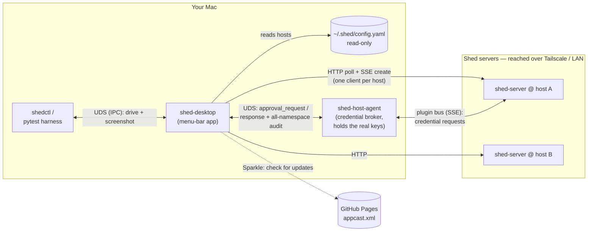

# Architecture

shed-desktop is a native macOS menu-bar app that ties the **shed** toolchain into one
resident control surface: it lists and controls sheds (VMs) across hosts, launches
remote-control agents, and brokers the credential-approval gate. It holds no credentials —
it coordinates the processes that do.

It is built as a SwiftUI app with a deliberate **core/UI split**: all I/O and logic live in
a UI-free core (`ShedKit`) so they're unit-testable without a running app. The shed-server
protocol layer (HTTP/SSE, decoding, control-token auth, TLS pinning) is extracted into a
shared **Rust core** (`shed-core`) that backs both this macOS app and a **GTK/Linux client**
(`shed-gtk`) without re-implementation — see [Rust core](rust-core.md). The Linux client
ships as the `shed-desktop` binary/package (the crate keeps the name `shed-gtk`) in an nfpm
`.deb` — with a headless `shedctl` alongside — via `charliek/apt-charliek` (`apt install
shed-desktop`). The Rust core is the macOS **default**; `SHED_DESKTOP_RUST_CORE=0` forces the
legacy Swift path (a rollback escape hatch). A first-class design goal is that the app is
**drivable and observable by an automated agent** over an IPC socket — see [IPC](ipc.md).

## Why a native app

The app's whole job is to call HTTP endpoints, consume SSE streams, shell out and read
pipes, and integrate deeply with macOS (menu bar, Touch ID, notifications, login item,
Sparkle). Swift does the first three natively (`URLSession.bytes`, `Process`/`Pipe`) and is
categorically best at the fourth. The one capability that would favor a web stack — an
embedded streaming terminal — is a deliberate non-goal (terminals are delegated to the
user's terminal app), which takes SwiftUI's weakest area off the critical path.

Electron was rejected on size (~85–120 MB of bundled Chromium); Tauri was the earlier lean
*when an embedded terminal was assumed* — once terminals are delegated out, its web-native
advantage no longer applies while its weak spots (menu-bar popover, Touch ID) are exactly
this app's headline features. If a future pane genuinely needs web rendering, a `WKWebView`
scoped to that one pane is the escape hatch — not the default substrate.

## System context

shed-desktop sits between three other systems: the **shed servers** (one per host, over
HTTP), the **shed-host-agent** (the local credential broker, over a Unix-domain socket),
and the **shed CLI's config file** (read-only). It also serves its own control socket that
`shedctl` and the test harness drive, and checks GitHub Pages for Sparkle updates.



The app is **never in the credential path**. A shed inside a VM asks its shed-server for a
credential (SSH signature, AWS creds, docker login); that request flows out over the
server's plugin bus to the host-agent, which holds the real keys. shed-desktop only sees
request *metadata* and returns an approve/deny decision (see [the approval flow](#the-host-agent-unix-domain-socket)).

## Targets (SPM modules)

| Target | Role |
|--------|------|
| `ShedKit` | Core, no SwiftUI. HTTP/SSE clients (`ShedServerClient`), models + `ShedConfig` parser, the IPC server, in-process screenshot, and the **Approval** subsystem (`HostAgentClient`, `PolicyEngine`, `AuditStore`, `NotificationPresenter`) behind the `UiBridge`/`ShedBackend` seam. |
| `ShedDesktopUI` | SwiftUI views (Sheds, Approvals, Agents, Activity, System, Preferences, the menu) + the `AppState` observable view-model. |
| `ShedDesktopApp` | The `@main` app: `AppModel` (host poller, windows, the `UiBridge` conformer, approval coordinator), `IPCHandlerImpl`, the real `SystemNotificationPresenter`, the Sparkle updater, and `PreferencesStore`. |
| `shedctl` | CLI driver for the app's IPC socket (mirrors the pytest harness's transport). |

## How the pieces connect

### Shed servers (HTTP)

`AppModel` builds one `ShedServerClient` per host from the config and fans out to all of
them concurrently. Unreachable hosts degrade to a grey dot, never a hard failure of the
whole list.

| Call | Endpoint | Notes |
|---|---|---|
| Server info | `GET /api/info` | name, version, ports, backend |
| List sheds | `GET /api/sheds` | tolerates `{"sheds": null}` → `[]`; stamps the host name |
| Disk usage | `GET /api/system/df` | the **System** pane (per-host totals + entries) |
| Lifecycle | `POST /api/sheds/{name}/start\|stop\|reset`, `DELETE /api/sheds/{name}` | |
| Create | `POST /api/sheds` with `Accept: text/event-stream` | **SSE** stream: `progress…` → `complete` / `error` |

Shed lifecycle has **no push event stream**, so the dashboard **polls** `GET /api/sheds`
on an interval. SSE is used *only* for create-progress (which the server does stream). The
HTTP API has no auth and relies on network-level access control (Tailscale/firewall): the
app treats a reachable server as already trusted by the network and never exposes it
further.

### The host agent (Unix-domain socket)

The headline feature. When an extension is configured with `approval.policy: shed-desktop`,
`shed-host-agent` (which always serves the local Unix-domain socket) delegates
that extension's **approval** decisions to the app (SSH interactively; AWS/Docker as a live
Allow/Deny), while streaming an **all-namespace audit feed** (ssh-agent + aws-credentials +
docker-credentials) that the app surfaces in **Activity**. See [Credential
approvals](approvals.md) for the policy model.

- **Socket:** `~/Library/Application Support/shed/host-agent.sock` (override
  `SHED_DESKTOP_HOST_AGENT_SOCKET`). `HostAgentClient` dials it, auto-reconnecting with
  0.5→5 s backoff.
- **Wire protocol** (newline-delimited JSON, `v=1`): app → agent `hello`,
  `approval_response`, `pong`; agent → app `hello_ack`, `approval_request`, `event`, `ping`.
  `hello_ack` advertises `namespaces`, `gate_namespaces`, `request_timeout_ms`.
- **Multi-server:** one agent can broker for many shed servers; `approval_request` and
  `event` frames carry a `server` field so identical shed names on different servers don't
  collide.
- **Fail-closed:** no connected app, a timeout, or a disconnect all resolve to *deny* — the
  same outcome as an unanswered local prompt. Only request metadata ever crosses the socket;
  the agent stays the sole key holder. The whole feature is **default-off** in the agent.

```mermaid
sequenceDiagram
    participant VM as shed VM (git push)
    participant SRV as shed-server
    participant HA as shed-host-agent
    participant SD as shed-desktop
    VM->>SRV: SSH-sign request (ssh-agent)
    SRV->>HA: deliver via plugin bus
    HA->>SD: approval_request (UDS)
    Note over SD: PolicyEngine.decide →<br/>auto / notification / Touch ID
    SD->>HA: approval_response (approve | deny)
    HA->>SRV: signature (or denial)
    SRV->>VM: result
    HA-->>SD: event (audit; all namespaces)
```

### The shed CLI config

shed-desktop reads the **same config the `shed` CLI manages** — `~/.shed/config.yaml`
(override `SHED_DESKTOP_SHED_CONFIG`) — to discover hosts. It parses it with a tiny
indentation reader (`ShedConfig`, no YAML dependency), reading `servers:` (name → `host`,
`http_port`, `ssh_port`) and `default_server`. The relationship is **read-only**: the app
never writes this file. To add or remove hosts, use the `shed` CLI; the app reflects the
change on its next poll (the Preferences → Hosts section is a read-only mirror). A missing
config degrades to an empty host list, never a crash.

### The control socket (shedctl + the harness)

So the app is drivable/observable by an automated agent, `ShedKit`'s `IPCServer` serves a
newline-JSON socket at `~/Library/Caches/ShedDesktop/shed-desktop.sock` (mode `0600`, with
a sibling `.lock` for single-instance). Both `shedctl` and the hermetic pytest harness speak
this exact protocol — listing state, navigating panes, driving lifecycle/approvals, and
capturing in-process PNG screenshots. This is the seam that lets every change be verified by
driving the real app, not by asking a human to click. The GTK/Linux client speaks the same
protocol (mirroring the `0600` socket + flock, with a second launch handed off via an
`app.activate` op), so **one** `tools/shedtest --target mac|gtk` harness drives both clients —
Mac-only ops stay Mac-gated. Note the two `shedctl`s: the Swift `Sources/shedctl` bundled in
the macOS `.app`, and the Rust `core/shedctl` shipped in the Linux `.deb` — same name,
different platforms. See [IPC](ipc.md) and [shedctl](cli.md).

## Windows

The dashboard and the menu-bar dropdown are **AppKit windows hosting SwiftUI views**
(`NSHostingController` / `NSPopover`), managed by `AppModel` — not a SwiftUI
`WindowGroup`/`MenuBarExtra`. This gives the screenshot op a stable `NSWindow` handle and
makes show/hide deterministic for the harness, where the built-in backing windows are
private/unstable. The app is an accessory (`LSUIElement`): menu-bar only, no Dock icon.

## State + storage

| What | Where | Notes |
|---|---|---|
| Audit log | `<stateDir>/audit.jsonl` | append-only JSONL; `stateDir` = `~/Library/Application Support/ShedDesktop/`, override `SHED_DESKTOP_STATE_DIR`. Reachable over IPC via `activity.log_path`. |
| Preferences | `UserDefaults` (`ai.stridelabs.ShedDesktop`) | three keys: `terminalTemplate`, `defaultApprovalMode`, `policyRules` (JSON). See [Configuration](configuration.md). |
| Control socket + lock | `~/Library/Caches/ShedDesktop/shed-desktop.{sock,lock}` | **not** moved by `SHED_DESKTOP_STATE_DIR` (so harness + dev session agree). |
| Log | `~/Library/Logs/ShedDesktop/shed-desktop.log` | |

## Security model

The app holds **no credentials and no secrets** — it coordinates processes that do. The
credential-approval gate is **fail-closed** (a missing or unresponsive app denies, matching
the host agent's unanswered-prompt outcome), and the app only ever handles request metadata,
never key material. It adds no remote attack surface: it makes outbound HTTP/UDS connections
and serves one local `0600` socket. Sparkle auto-update authenticity rests on an **EdDSA
signature** over each release, independent of Apple notarization (see [RELEASING](https://github.com/charliek/shed-desktop/blob/main/RELEASING.md)).
